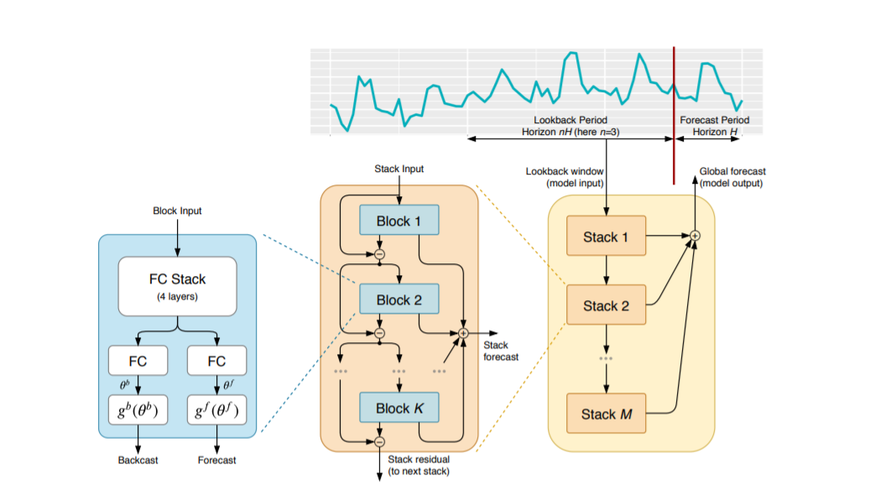

# KerasBeats
----
An easy, accessible way to use the NBeats model architecture in Keras.

 **Table of Contents:**
   - [Introduction](###Introduction)
   - [Installation](###Installation)
   - [Basic Usage](###Basic Usage)
   - [KerasBeats layer](###KerasBeats layer)
   - [KerasBeats as keras model](###KerasBeats as keras model)

### Introduction
Introduction goes here.

### Installation
Data goes here.

### Basic Usage
Data goes here.

### KerasBeats layer
Data goes here.

### KerasBeats as keras model
Data goes here.
